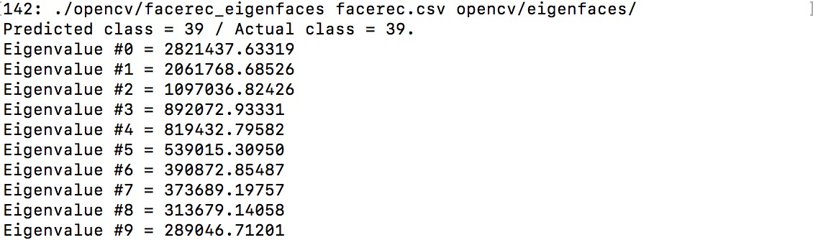
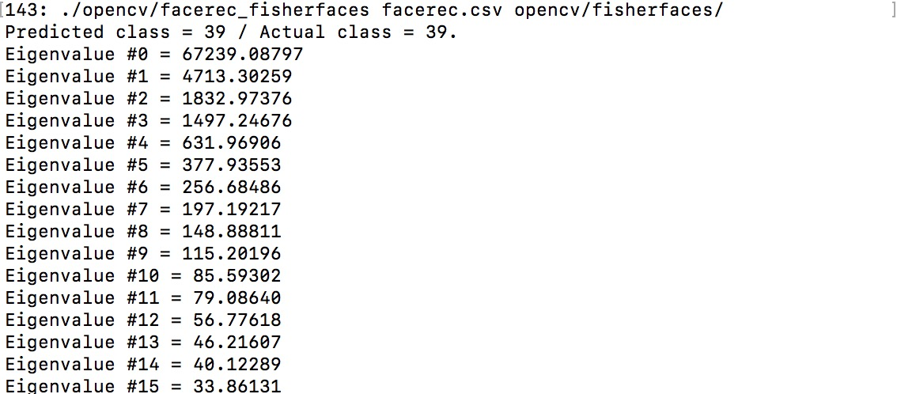
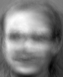
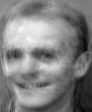
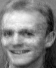
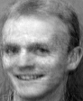
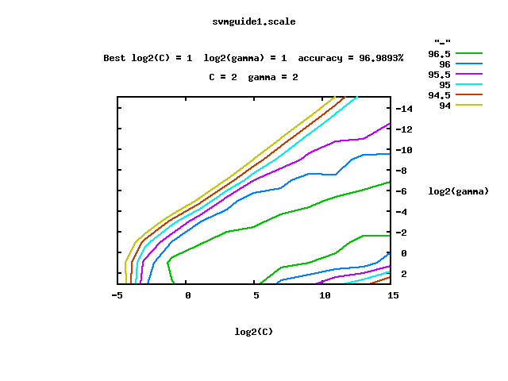

# 模式识别第三次作业

* 姓名：潘国盛(本科保送)	本科学号：3014218157	院系：计算机系研究生

1.  ​

   (a) 矩阵的二范数为最大特征值的开方，且互逆矩阵的特征值互为倒数。

   所以$$k_2(X)=\frac {\sigma_1}{\sigma_n}$$

   (b) X是满秩的方阵，可以看作线性变化，或者是旋转、缩放、平移这些操作的叠加或单个操作。而通过PCA的学习我们知道X方阵将一块圆形区域变为一个椭圆形，而椭圆形的的轴长与原矩阵的特征值正相关。2范式条件数就是最长轴除以最短轴，椭圆形越扁这个值越大，也代表对输入值a的改变大。

   (c) 正交矩阵逆矩阵就是自己的转置矩阵且特征值为1或-1，所以条件数也是1或-1。这相当于一个旋转变换或一个翻转变化，并不会改变轴长，所以是well-conditioned的

2.  ​

   (c)

   PCA的运行结果如下 ：

   

   而FLD的运行结果如下：

   

   PCA的目标是保留所有数据最大的方差，所以会选择特征值最大的方向进行保留，而FLD既需要保证类间距离最大同时还要保证类内距离最小，所以选择的特征值往往不是最大的那个。

   (d) 下面是10,100,190,250,295,以及原图

       

   190左右的时候牙齿已经可以看清，250左右的时候已经相当接近原图

   ​

3.  ​

   (a) 下载文件后解压并执行make命令完成编译，并安装gnuplot

   ``` bash
   $ sudo apt-get install gnuplot-x11
   ```

   ​

   (b)

   **i.** 

   ``` bash
   $ ./svm-train -t 2 -c 1 svmguide1
   optimization finished, #iter = 5371
   nu = 0.606150
   obj = -1061.528918, rho = -0.495266
   nSV = 3053, nBSV = 722
   Total nSV = 3053

   $ ./svm-predict svmguide1.t svmguide1.model svmguide1.output
   Accuracy = 66.925% (2677/4000) (classification)
   ```

   ​

   **ii.** 

   对训练数据进行标准化，并把结果输出至文件

   ``` bash
   $ ./svm-scale -s scale_svmguide1 svmguide1 > new_svmguide1
   ```

   得到的输出文件`scale_svmguide1`内容为缩放后的最小值与最大值以及缩放前每一维的最小值、最大值

   ``` text
   x
   -1 1
   1 0 297.05
   2 -4.555206 581.0731
   3 -0.7524385 0.7170606
   4 8.157474000000001 180
   ```

   同样缩放测试集

   ``` bash
   $ ./svm-scale -s scale_svmguide1.t svmguide1.t > new_svmguide1.t
   ```

   然后进行训练

   ``` bash
   $ ./svm-train -t 2 -c 1 new_svmguide1
   optimization finished, #iter = 496
   nu = 0.202599
   obj = -507.307046, rho = 2.627039
   nSV = 630, nBSV = 621
   Total nSV = 630

   $ ./svm-predict new_svmguide1.t new_svmguide1.model new_svmguide1.output
   Accuracy = 95.6% (3824/4000) (classification)
   ```

   ​

   **iii.**

   ``` bash
   $ ./svm-train -t 0 -c 1 svmguide1
   optimization finished, #iter = 3509115
   nu = 0.121917
   obj = -376.234540, rho = 5.887607
   nSV = 381, nBSV = 375
   Total nSV = 381

   $ ./svm-predict svmguide1.t svmguide1.model svmguide1.output
   Accuracy = 95.675% (3827/4000) (classification)
   ```

   ​

   **iv**

   ``` bash
   $ ./svm-train -t 0 -c 1 svmguide1
   optimization finished, #iter = 6383
   nu = 0.000721
   obj = -1114.038221, rho = -0.407723
   nSV = 3001, nBSV = 0
   Total nSV = 3001

   $ ./svm-predict svmguide1.t svmguide1.model svmguide1.output
   Accuracy = 70.475% (2819/4000) (classification)
   ```

   ​

   **v.**

   ``` bash
   $ ./easy.py ../svmguide1 ../svmguide1.t
   Scaling training data...
   Cross validation...
   Best c=2.0, g=2.0 CV rate=96.9893
   Training...
   Output model: svmguide1.model
   Scaling testing data...
   Testing...
   Accuracy = 96.875% (3875/4000) (classification)
   Output prediction: svmguide1.t.predict

   ```

   

   超参数的设置对SVM的分类精确度有很大的影响

   (c)

   svmguide3是一个 imbalanced datasets ，其中‘+1‘类有296个而’-1‘类又947个

   如果设置等权重训练，那么得到的结果

   ``` bash
   $ ./svm-train -t 2 -c 1 svmguide3
   optimization finished, #iter = 535
   nu = 0.452614
   obj = -545.901031, rho = -0.985060
   nSV = 570, nBSV = 552
   Total nSV = 570

   $ ./svm-predict svmguide3.t svmguide3.model svmguide3.output
   Accuracy = 2.43902% (1/41) (classification)
   ```

   而设置'+1'类权重为3.1993后

   ``` bash
   $ ./svm-train -t 2 -c 1 -w1 3.1993 svmguide3
   optimization finished, #iter = 1126
   obj = -1402.089020, rho = -3.212808
   nSV = 984, nBSV = 973
   Total nSV = 984

   $ ./svm-predict svmguide3.t svmguide3.model svmguide3.output
   Accuracy = 70.7317% (29/41) (classification)
   ```

   有明显提升效果


4.  ​

   (a)

   求概率密度积分
   $$
   \int_{x_m}^{+\infty}\frac{c_1}{x^{\alpha+1}}=1
   $$
   解得
   $$
   c_1 = \alpha x_m^{\alpha}
   $$
   所以X也服从Pareto分布

   ​

   (b)

   对数似然函数

   $\theta = \arg\max_{x_m, \alpha} \sum_{i=1}^{n}\log(\frac{\alpha x_{m}^{\alpha}}{x_i^{\alpha+1}}\mathbb{I}x \ge x_m\mathbb{I})$

   $x_m=\min(x_i)$

   对$\alpha$求偏导使为0得解

   $ \frac{n}{\alpha} + n\ln x_m - \sum_{i=1}^{n}=0$

   $\alpha = (\frac{1}{n}\sum_{i=1}^{n}(\ln x_i) - \ln x_m)^{-1}$

   (c) 

   ​

5.   ​

   (a) 下载源码文件后，解压进入目录输入命令

   ``` bash
   make
   ```

   就会出现两个可执行文件`train`       `predict`

   如果要配置matlab接口，则matlab进入源码中/matlab目录下进行make即可

   (b) 

   ```bash
   $ ./train mnist
   $ ./predict mnist.t mnist.model mnist.output
   Accuracy = 80.26% (8026/10000)
   ```

   精确率是80.26%

   (c)

   ``` bash
   $ ./train mnist.square
   $ ./predict mnist.square.t mnist.square.model mnist.square.output
   Accuracy = 87.22% (8722/10000)
   ```

   精确率为87.22%

   (d)

   可能手写数字集并非一个线性可分的数据集，无法直接使用超平面将数据完美分割开，所以当使用平方根转换后，有可能增加数据的分类精确率

   ​

6.   ​

   (a)  距离矩阵的性质：对称性、非负性、自反性(主对角元为0)、满足三角不等式(D(i,j) + D(j, k) >= D(i, k))

   (b) 

   得到的KL散度矩阵
   $$
   \begin{bmatrix}
   0 & 0.21 & 0.60\\ 
   0.19 & 0 & 0.08\\ 
   0.46 & 0.07 & 0
   \end{bmatrix}
   $$
   KL散度矩阵不是一个距离矩阵，不满足对称性和三角不等式，但是满足非负性和自反性

   (c) 

   ``` python
   import numpy as np

   arr = np.array([[1/2, 1/2], [1/4, 3/4], [1/8, 7/8]])
   result = np.zeros([3,3])

   for i in range(arr.shape[0]):
       p = arr[i]
       for j in range(arr.shape[0]):
           q = arr[j]
           result[i, j] = np.sum(p * (np.log2(p / q))) #KL

   for i in range(arr.shape[0]):
       print('%7.4f%7.4f%7.4f'%(result[i,0], result[i, 1], result[i, 2]))
   ```

   ​

7.   
   $$
   \begin{align*}
   &\max_{q}\int_{-\infty}^{+\infty}-q(x)\ln q(x) dx\\
   &s.t. \int_{-\infty}^{+\infty}q(x) dx = 1\\
   &\ \ \ \ \ \ \mu = \int_{-\infty}^{+\infty}xq(x) dx > 0\\
   \end{align*}
   $$
   拉格朗日乘子法求解

   ​